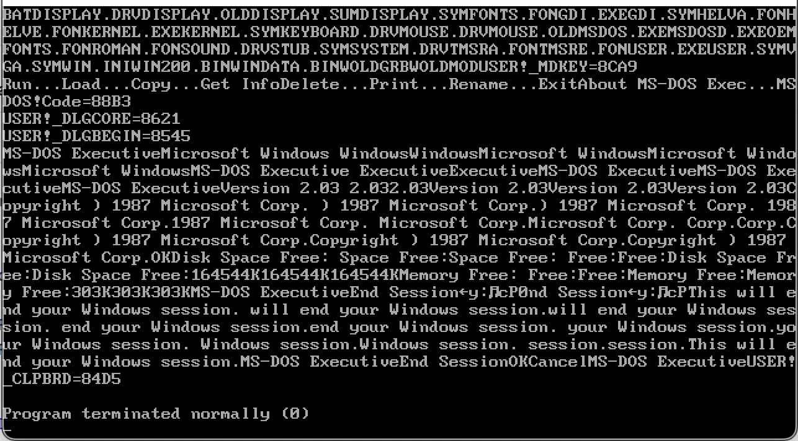

# win2stub_dd
Windows 2.x stub display driver - work in progress

This is a seriously cut-down version of Microsoft Windows 2.1 DDK driver for
EGAHIBW. It misses most of the GDI parts yet it "works" in a sense that 
it is possible to load the system with this driver, and the system will
be fully* operational except for the display.

## Motivation
Windows 1.x-3.x display drivers have a large chunk of Windows GDI code inside.
Microsoft thought it was a good idea, because driver developers could 
leverage hardware acceleration this way. In reality, it turned out
to be a terrible idea. All the display drivers had to be forks 
of Microsoft reference implementation drivers, and it has lots of 
internal references.

I have tried to create a "stub" driver implementing the basic functions
Windows kernel expected the display driver to have a few times, but
somehow it always ended up being a driver that makes GDI crash on 
start. And don't get me wrong, I love debugging 16-bit realmode
code. But it is super yucky to do when you have no sources for it.

And, uh, your debugger is symdeb.

So, it is proving to be much more productive to cut big chunks
of the driver off and see what breaks, and fix it.

The end result, hopefully, would be a very lean driver that
looks a lot like the driver from MS DDK reference, but with stubs
that would allow a custom implementation for major chunks of the driver.

That would help me to do two things:
* Understand how exactly Windows 2.x video drivers work,
* Make a custom Windows 2.x video driver for a computer that I have,
* Make a custom Windows 3.x video driver for a computer that I have

Ogeh, stack protector!!

## How to build
0. Get a DOS 3.3+ computer/virtual machine
1. Get Windows 2.0 or Windows 2.1 DDK and MASM 4.0+
2. Install tools from Windows DDK into %PATH%
3. Prepare debuggable Windows 2.x copy using folder WINBOOT from your DDK set
4. Go to the folder of win2stub_dd (you'd have to rename it to 8.3 format maybe)
5. `make makefile`. This should compile a bunch of `*.obj` files, and link them into a file egahibw.drv. Res file is already pre-compiled
6. Copy egahibw.drv into your WINBOOT folder
7. Run `symdev kernel.exe` from your WINBOOT folder. 
8. Press `g` and `Enter` to start the system. Press Alt+F4 to initiate "This will end your windows sessions" Dialogue. Press "Enter" to exit.

## Known issues
The default IBM PC keyboard driver has a special check for text/graphics mode, and turns itself out
when BIOS reports its in the text mode. There's a ever-so-slightly patched keyboard driver in KEYBOARD
folder that works with this video driver.

There's still a lot of code cleanup needed.
